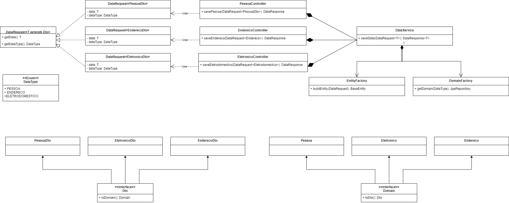

# API Energy Monitor
## Bem-vindo à API Energy Monitor! Aqui você encontrará informações sobre como utilizar os endpoints para criar e manipular dados.

## Sobre
```
-API Energy Monitor permite o gerenciamento da energia consumida por aparelhos eletrônicos diversos, 
monitorando em tempo real e gerando historico de consumo de energia elétrica.

-Disponibilizamos três endpoints: Enderecos, Pessoas e Eletronicos, nos quais aplicamos a mesma 
abstração, onde os dados serão recebidos e a seguir validados. Com essa premissa criamos uma 
interface Dto para ser implementada nas trê requisições; Essa interface possui um método toDomain()
para obter a classe de domínio referente a cada requisição, onde poderemos aplicar as regras de 
negócios específicas para cada fluxo. Com isso, foi necessário apenas um Service para implementar
todas as requisições.
```
## Tecnologias adotadas
```
-Java 17: programação server-side
-SpringBoot: criação API Restfull e microsserviços
```
## Arquitetura


## Endpoints
* [Pessoa](#pessoa)
* [Endereço](#Endereço)
* [Aparelho Eletrônico](#Eletrônico)


## Pessoa

* Rota POST http://localhost:8080/pessoas

Você pode utilizar o seguinte JSON como exemplo para cadastrar um novo usuario:

```sh
{
  "nome": "João",
  "dataNascimento": "01-01-1990",
  "genero": "MASCULINO",
  "parentesco": "OUTRO"
}
```


* Descrição dos Campos

Campo   | Descrição
--------- | ------
nome | O nome da pessoa. Deve ser uma string.
dataNascimento  |A data de nascimento da pessoa no formato "dd-MM-aaaa".
genero |O gênero da pessoa. Pode ser "MASCULINO", "FEMININO" ou "OUTRO".
parentesco |O tipo de parentesco da pessoa. Pode ser "FILHO", "FILHA", "IRMAO", "IRMA" "PAI", "MAE", "OUTRO", ou outro valor válido.

####  Se você deseja copiar e editar o JSON de exemplo para criar uma nova pessoa, sinta-se à vontade para fazer isso! Basta copiar o JSON acima, modificá-lo conforme necessário e enviá-lo como corpo da requisição POST para o endpoint /pessoas.

  * Exemplo de Resposta

    Após enviar a requisição, você receberá a seguinte resposta:  
```sh
{
  "nome": "João",
  "dataNascimento": "01-01-1990",
  "genero": "MASCULINO",
  "parentesco": "OUTRO"
}
```
## Endereço

* Rota POST http://localhost:8080/enderecos

    Você pode utilizar o seguinte JSON como exemplo para cadastrar um novo endereço:

```sh
{
    "rua": "EQ 5/8 Bloco B Casa",
    "número": 2,
    "bairro": "Setor Oeste",
    "cidade": "Gama",
    "estado": "DF"
}
```

* Descrição dos Campos

Campo   | Descrição
--------- | ------
rua | O nome da rua.
número  |O número da casa ou estabelecimento.
bairro |O nome do bairro.
cidade |O nome da cidade.
estado |A sigla do estado ("AC", "AL","AP","AM","BA","CE","DF","ES","GO","MA","MT","MS","MG","PA","PB","PR","PE","PI","RJ","RN","RS","RO","RR","SC","SP","SE" ou TO.)

* Exemplo de Resposta

  Após enviar a requisição, você receberá a seguinte resposta."

```sh
{
    "rua": "EQ 5/8 Bloco B Casa",
    "número": 2,
    "bairro": "Setor Oeste",
    "cidade": "Gama",
    "estado": "DF"
}
```

## Eletrônico

* Rota POST : http://localhost:8080/eletronicos
  
  Você pode utilizar o seguinte JSON como exemplo para cadastrar um novo eletrônico.

```sh
{
    "nome": "Televisão",
    "modelo": 100,
    "potencia": 5
}
```
* Descrição dos Campos

Campo   | Descrição
--------- | ------
nome | O nome do eletrônico
modelo  |descrição do fabricante, marca, número série.
potência |A potência do eletrônico em Watts

* Exemplo de Resposta

  Após enviar a requisição, você receberá a seguinte resposta. 
```sh
{
    "nome": "Televisão",
    "modelo": 100,
    "potencia": 5
}
```

## Dificuldades e Aprendizados
* A não padronização dos ambientes da equipe gerou falhas no build do projeto.
* A utilização de IDE (Integrated Developer Envoirement – Ambiente de Desenvolvimento Integrado)
idênticas por parte dos menbros da equipe, evita problemas de incompatibilidade.
