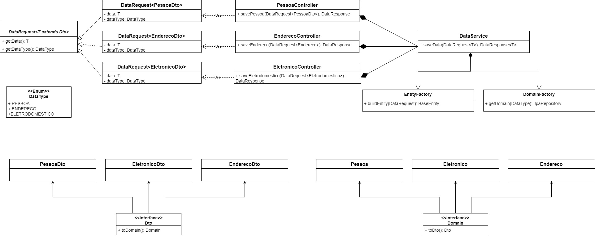

# API Energy Monitor
## Bem-vindo à API Energy Monitor! Aqui você encontrará informações sobre como utilizar os endpoints para criar e manipular dados.

## Sobre
```
-API Energy Monitor permite o gerenciamento da energia consumida por aparelhos eletrônicos diversos,
monitorando em tempo real e gerando historico de consumo de energia elétrica.

-Disponibilizamos cinco endpoints: Enderecos, Pessoas, Eletronicos, Consumo e Usuários nos quais
aplicamos a mesma abstração, onde os dados serão recebidos e a seguir validados. Com essa premissa
criamos uma interface Dto para ser implementada nas cinco requisições; Essa interface possui um método
toDomain() para obter a classe de domínio referente a cada requisição, onde poderemos aplicar as
regras de negócios específicas para cada fluxo. 
```

## Tecnologias adotadas
```
-Java 17: programação server-side
-SpringBoot: criação API Restfull e microsserviços
-Docker: Gerar container do SGBD PostgresSQL
-PostgresSQL: Instanciado via Docker
-DBeaver: Front-End para o SGBD
-PostMan: Utilizado nos testes dos endpoints
-Swagger: Modelagen, documentação e teste dos endpoints
```

## Arquitetura


## Endpoints
* [Pessoa](#pessoa)
* [Endereço](#Endereço)
* [Aparelho Eletrônico](#Eletrônico)
* [Consumo](#consumo)
* [Usuário](#usuário)

## Pessoa

* Rota POST http://localhost:8080/pessoas

Você pode utilizar o seguinte JSON como exemplo para cadastrar um novo usuario:

```sh
{
  "nome": "João",
  "dataNascimento": "01-01-1990",
  "genero": "MASCULINO",
  "parentesco": "OUTRO"
}
```

* Descrição dos Campos

Campo   | Descrição
--------- | ------
nome | O nome da pessoa. Deve ser uma string.
dataNascimento  |A data de nascimento da pessoa no formato "dd-MM-aaaa".
genero |O gênero da pessoa. Pode ser "MASCULINO", "FEMININO" ou "OUTRO".
parentesco |O tipo de parentesco da pessoa. Pode ser "FILHO", "FILHA", "IRMAO", "IRMA" "PAI", "MAE", "OUTRO", ou outro valor válido.

####  Se você deseja copiar e editar o JSON de exemplo para criar uma nova pessoa, sinta-se à vontade para fazer isso! Basta copiar o JSON acima, modificá-lo conforme necessário e enviá-lo como corpo da requisição POST para o endpoint /pessoas.

  * Exemplo de Resposta

    Após enviar a requisição, você receberá a seguinte resposta:  
```sh
{
  "nome": "João",
  "dataNascimento": "01-01-1990",
  "genero": "MASCULINO",
  "parentesco": "OUTRO"
}
```

* Rota GET http://localhost:8080/pessoas/1

Essa rota faz a consulta de pessoa pelo id:

 * Exemplo de Resposta

    Após enviar a requisição, você receberá a seguinte resposta:  
```sh
{
  "nome": "João",
  "dataNascimento": "01-01-1990",
  "genero": "MASCULINO",
  "parentesco": "OUTRO"
}
```

* Rota PUT http://localhost:8080/pessoas/1

Essa rota faz a atualização de pessoa pelo id:

Você pode utilizar o seguinte JSON como exemplo para cadastrar um novo usuario:

```sh
{
  "nome": "Joana",
  "dataNascimento": "09-09-1999",
  "genero": "FEMININO",
  "parentesco": "OUTRO"
}
```

 * Exemplo de Resposta

    Após enviar a requisição, você receberá a seguinte resposta:  
```sh
{
  "nome": "Joana",
  "dataNascimento": "09-09-1999",
  "genero": "FEMININO",
  "parentesco": "OUTRO"
}
```

* Rota DELETE http://localhost:8080/pessoas/1

Essa rota faz a exclusão de pessoa pelo id:
  
## Endereço

* Rota POST http://localhost:8080/enderecos

    Você pode utilizar o seguinte JSON como exemplo para cadastrar um novo endereço:

```sh
{
    "rua": "EQ 5/8 Bloco B Casa",
    "número": 2,
    "bairro": "Setor Oeste",
    "cidade": "Gama",
    "estado": "DF"
}
```

* Descrição dos Campos

Campo   | Descrição
--------- | ------
rua | O nome da rua.
número  |O número da casa ou estabelecimento.
bairro |O nome do bairro.
cidade |O nome da cidade.
estado |A sigla do estado ("AC", "AL","AP","AM","BA","CE","DF","ES","GO","MA","MT","MS","MG","PA","PB","PR","PE","PI","RJ","RN","RS","RO","RR","SC","SP","SE" ou TO.)

* Exemplo de Resposta

  Após enviar a requisição, você receberá a seguinte resposta."

```sh
{
    "rua": "EQ 5/8 Bloco B Casa",
    "número": 2,
    "bairro": "Setor Oeste",
    "cidade": "Gama",
    "estado": "DF"
}
```

* Rota GET http://localhost:8080/enderecos/1

  Essa rota fará a consulta do endereço pelo id:

* Exemplo de Resposta

  Após enviar a requisição, você receberá a seguinte resposta."

```sh
{
    "rua": "EQ 5/8 Bloco B Casa",
    "número": 2,
    "bairro": "Setor Oeste",
    "cidade": "Gama",
    "estado": "DF"
}
```

* Rota GET http://localhost:8080/enderecos

  Essa rota retorna a lista de endereços:

* Exemplo de Resposta

  Após enviar a requisição, você receberá a seguinte resposta."

```sh
{
    "rua": "EQ 5/8 Bloco B Casa",
    "número": 2,
    "bairro": "Setor Oeste",
    "cidade": "Gama",
    "estado": "DF"
}
```

* Rota UPDATE http://localhost:8080/enderecos/1

  Essa rota fará atualização do endereço informado via id.
  Informar endereço atualizado no formato JSON conforme:

```sh
{
    "rua": "SBS Quadra 2 Edifício G",
    "número": 12,
    "bairro": "Asa Sul",
    "cidade": "Brasília",
    "estado": "DF"
}
```

* Exemplo de Resposta

  Após enviar a requisição, você receberá a seguinte resposta."

```sh
{
    "rua": "SBS Quadra 2 Edifício G",
    "número": 12,
    "bairro": "Asa Sul",
    "cidade": "Brasília",
    "estado": "DF"
}
```

* Rota DELETE http://localhost:8080/enderecos/2
  Essa rota fára esclusão do endereço informado no id:

## Eletrônico

* Rota POST : http://localhost:8080/eletronicos
  
  Você pode utilizar o seguinte JSON como exemplo para cadastrar um novo eletrônico.

```sh
{
    "nome": "Televisão",
    "modelo": 100,
    "potencia": 5
}
```

* Descrição dos Campos

Campo   | Descrição
--------- | ------
nome | O nome do eletrônico
modelo  |descrição do fabricante, marca, número série.
potência |A potência do eletrônico em Watts

* Exemplo de Resposta

  Após enviar a requisição, você receberá a seguinte resposta. 
```sh
{
    "nome": "Televisão",
    "modelo": 100,
    "potencia": 5
}
```

* Rota GET : http://localhost:8080/eletronicos
  
  Essa rota retorna listagem dos eletrônicos.

* Exemplo de Resposta

  Após enviar a requisição, você receberá a seguinte resposta. 
```sh
{
    "nome": "Televisão",
    "modelo": 100,
    "potencia": 5
}
```

* Rota GET : http://localhost:8080/eletronicos/2
  
  Essa rota retorna o eletrônico informado pelo id.

* Exemplo de Resposta

  Após enviar a requisição, você receberá a seguinte resposta. 
```sh
{
    "nome": "Televisão",
    "modelo": 100,
    "potencia": 5
}
```

* Rota GET : http://localhost:8080/eletronicos/filter?nome=Telev?modelo=100
  
  Essa rota retorna listagem dos eletrônicos de acordo com os filtros (semânticos) informados na URL.
  Campos de filtro: nome e modelo

* Exemplo de Resposta

  Após enviar a requisição, você receberá a seguinte resposta. 
```sh
{
    "nome": "Televisão",
    "modelo": 100,
    "potencia": 5
}
```

* Rota PUT : http://localhost:8080/eletronicos/2
  Essa rota atualiza o eletrônico informado no id.
  Informar nos dados da no JSON como exemplo para atualizar um eletrônico.

```sh
{
    "nome": "Televisão",
    "modelo": "SmarTV",
    "potencia": 5
}
```

* Exemplo de Resposta

  Após enviar a requisição, você receberá a seguinte resposta. 
```sh
{
    "nome": "Televisão",
    "modelo": "SmarTV",
    "potencia": 7
}
```

* Rota DELETE : http://localhost:8080/eletronicos/2
  
  Essa rota exclui o eletrônico informado pelo id.

## Consumo

* Rota POST : http://localhost:8080/consumo
  
  Você pode utilizar o seguinte JSON como exemplo para cadastrar um novo consumo.

```sh
{
    "inicioFuncionamento": "2023-09-04T13:30:56:0000"
}
```

* Descrição dos Campos

Campo   | Descrição
--------- | ------
inicioFuncionamento | Informa o instante do início de funcionamento do aparelho eletrônico.
fimFuncionamento  | Informa o instante do fim de funcionamento do aparelho eletrônico.
consumo | Esse campo é calculado de acordo como iníciofuncionamento, fimFuncionamento e potência do aparelho.

* Exemplo de Resposta

  Após enviar a requisição, você receberá a seguinte resposta. 
```sh
{
    "inicioFuncionamento": "2023-09-04T13:30:56:0000"
}
```

* Rota GET : http://localhost:8080/consumo/3
  
  Retorna o consumo do aparelho informado via id.
  
* Exemplo de Resposta

  Após enviar a requisição, você receberá a seguinte resposta. 
```sh
{
    "inicioFuncionamento": "2023-09-04T13:30:56:0000",
     "fimFuncionamento": "2023-09-04T13:45:56:0000",
     "consumo": 75
}
```

* Rota GET : http://localhost:8080/consumo

  Retorna listagem dos aparelhos e seu consumo.
  
* Rota UPDATE : http://localhost:8080/consumo/3

  Atualiza o consumo do endereço informado no id.
  
* Exemplo de Resposta

  Após enviar a requisição, você receberá a seguinte resposta. 
```sh
{
    "inicioFuncionamento": "2023-09-04T13:30:56:0000",
     "fimFuncionamento": "2023-09-04T13:45:56:0000",
     "consumo": 75
}
```

## Usuário

* Rota POST : http://localhost:8080/usuario
  
  Você pode utilizar o seguinte JSON como exemplo para cadastrar um novo usuário.

```sh
{
    "nomeCompleto": "Fulano de Tal",
    "username": "fulano",
    "cpf": 52365895494,
    "email": "usuario@provedor.com"
}
```

* Descrição dos Campos

Campo   | Descrição
--------- | ------
nomeCompleto | Nome completo do usuário
username | Nome que identifica unicamente o usuário
cpf | Número do CPF do usuário
email | E-mail do usuário

* Exemplo de Resposta

  Após enviar a requisição, você receberá a seguinte resposta. 
```sh
{
    "nomeCompleto": "Fulano de Tal",
    "username": "fulano",
    "cpf": 52365895494,
    "email": "fulano@provedor.com"
}
```

* Rota GET : http://localhost:8080/usuario/5

  Retorna usuário informado no id.

```sh
{
    "nomeCompleto": "Fulano de Tal",
    "username": "fulano",
    "cpf": 52365895494,
    "email": "usuario@provedor.com"
}
```


* Rota GET : http://localhost:8080/usuario  

  Retorna listagem dos usuários.

* Rota PUT : http://localhost:8080/usuario/5
  
  Atualiza dados do usuário informado via id.
  Os novos dados devem ser infomado via arquivo JSON.

```sh
{
    "nomeCompleto": "Beltrano de Tal",
    "username": "beltrano",
    "cpf": 56546565645,
    "email": "usuario@provedor.com"
}
```

* Exemplo de Resposta

  Após enviar a requisição, você receberá a seguinte resposta. 
```sh
{
    "nomeCompleto": "Beltrano de Tal",
    "username": "beltrano",
    "cpf": 56546565645,
    "email": "beltrano@provedor.com"
}
```

* Rota DELETE : http://localhost:8080/usuario/5

  Exclui usuário informado no id.


## Dificuldades e Aprendizados
```
* A não padronização dos ambientes da equipe gerou falhas no build do projeto.
* O grupo não alinhou a finalização dos módulos da pós-graduação para liberar tempo adequado para o
desenvolvimento do projeto.
* Horários de reunião do grupo divergiu entre alguns participantes.
* Dificuldade no entendimento do enunciado do projeto. Exemplo: O relacionamento de algumas entidades.

* A utilização de IDE (Integrated Developer Envoirement – Ambiente de Desenvolvimento Integrado) idênticas
por parte dos membros da equipe, evita problemas de incompatibilidade.
```
